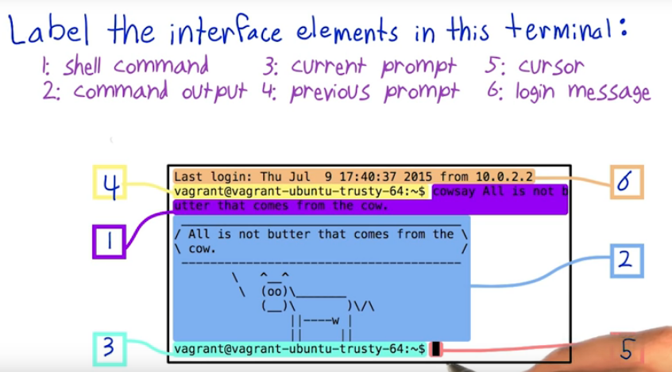

# UD595 - Linux Command Line Basics - `Lesson01`

#### Tags

* Author:      : AH Uyekita
* Chapter      : Get Into the Shell
* Start        : 20/12/2018
* End (Planned): 20/12/2018
* Title        : Linux Command Line Basics
* COD          : UD595
    * **Instructor:** Philip Mallory
    * **Instructor:** Karl Krueger

#### Requirements

This class will use the VirtualBox and Vagrant software to emulate a Linux environment. The former is necessary to create the Virtual Machine (VM) and the latter is responsible to configure it.

* [VirtualBox][virtualbox_webiste]
* [Vagrant][vagrant_website]

It is also necessary the Git.

* [Git][git_dl]

[virtualbox_webiste]: https://www.virtualbox.org/wiki/Downloads
[vagrant_website]: https://www.vagrantup.com/downloads.html
[git_dl]: http://git-scm.com/downloads

********************************************************************************

## Linux Command Line Basics

For this lesson I will use a Virtual Machine with Ubuntu instaled in it.

#### The Terminal Interface

The terminal interface has some elements:



#### Terminal vs Shell

The terminal is a program that draws text in windows but does not understand what you type, so it uses the shell to interprets the text and returns something to be drawn by the terminal.

#### Shell commands vs Functions

Functions are used to organize programs, whereas shell commands as used to run programs.

## List of Commands

This is a list of commands learnt in the lesson.

_Obs.: If you want to write a apostrophe you must use the slash before it._
```
\'
```

#### `date`

```
$ date
qui, 20 de dez de 2018 17:01:22
```

Return the date.

#### `expr`

This expression must be spaced by space. I have only tested with additions and subtractions.

```
$ expr 2 + 2
4
```

#### `echo`

Repeat back what you have written after the echo.

```
$ echo Hello World
Hello World
```

#### `uname`

Print the operation system.

```
$ uname
Linux
```

#### `hostname`

Print the computer's name.

```
$ hostname
fulano_laptop
```

#### `host anywebsite.com`

Print the domain name service.

```
$ host udacity.com
udacity.com has address 12.123.12.123
udacity.com mail is handled by 20 ...
...
```

#### `bash --version`

Print the version of the Bash installed in the computer.

```
$ bash --version
GNU bash, version 4.3.11
```
Also you can use `-V` (dash and capital V).
```
$ python -V
Python 3.7.1
```

#### `history`

Print a list of all commands used previously.
