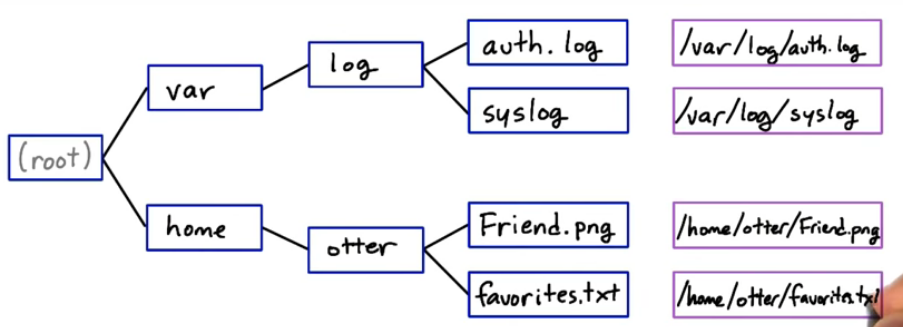

# UD595 - Linux Command Line Basics - `Lesson03`

#### Tags

* Author:      : AH Uyekita
* Chapter      : Get Into the Shell
* Start        : 20/12/2018
* End (Planned): 20/12/2018
* Title        : Intro to the Filesystem
* COD          : UD595
    * **Instructor:** Philip Mallory
    * **Instructor:** Karl Krueger

********************************************************************************

## The Linux Filesystem

The Linux filesystem has two kinds of objects:

* Regular files: text, images, programs, zip, etc.;
* Directories/Folders: a container that holds several files, and also could have other directories nested.

The Figure 1 show a example of The Filesystem Tree.




#### `pwd`

This command print the current work directory.

```
$ pwd
/home/vagrant
```

#### `cd`

Means change directory.

```
$ cd new_directory
new_directory $
```
You can also use `cd ..` to go back to the parent folder.

Or just type `cd` to go back to the home (current work directory).

There a meaning for `.` and `..`.

* `.` single dot: will leave you in the same directory you are currently in;
* `..` double dot: the path from the current directory work.

#### `mv`

Move command.

The sintaxe is very simple: move [source] [destination]

**Example:**
```
$ mv beach.jpg Photos
```

I moved the beach.jpg file to the Photos folder.

#### `cp`

This is the copy command.

```
$ cp my_text.txt
```

#### `mkdir`

Make a new directory.

```
$ mkdir my_new_directory
```

#### `rmdir`

Remove a directory (must be empty).

```
$ rmdir my_new_directory
```
If not empty, you must use the recursive mode to erase all the files inside.

```
$ rmdir -r my_new_directory
```

#### `globbing`

This is a command to find files with a pattern.

**Example:** Will find all html files.
```
$ ls *html
```

**Example:** Will find all files with pp in the filename.
```
$ ls *pp*
```

**Other Examples:**
```
$ ls bea?.png
$ ls be??.png
$ ls app.{css,html}
$ ls be[aeiou]r.png
```
